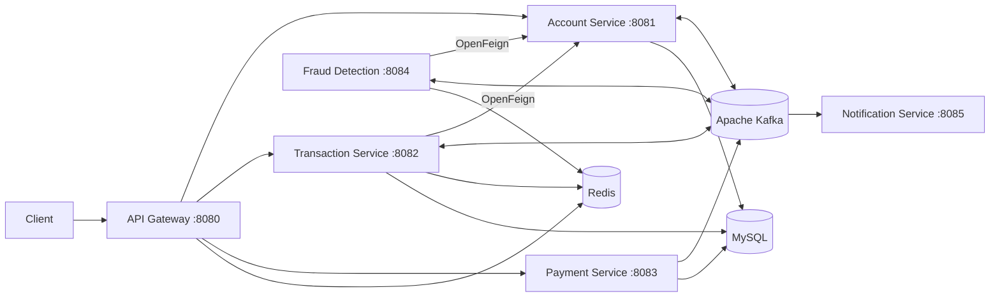

# Digital Banking System

Digital Banking System is a Java 17 and Spring Boot microservices backend for account management, bank transfers, fraud screening, payment processing, and event-driven notifications. It combines synchronous REST communication with Apache Kafka events and uses a Saga-style workflow to coordinate transfers across independently deployable services.

> **Project status:** Under active development — approximately **65% complete**. Core account and transfer flows are implemented, while payment hardening, notification delivery, security, automated testing, and deployment work are still in progress.

## Architecture



## Microservices

| Service | Port | Responsibility | Status |
| --- | ---: | --- | --- |
| API Gateway | `8080` | Routes account, transaction, and payment APIs; applies Redis-backed IP rate limiting | Implemented |
| Account Service | `8081` | Creates accounts, returns balances, credits and deducts funds, and blocks accounts | Implemented |
| Transaction Service | `8082` | Starts transfers, stores transaction history, verifies OTPs, completes transfers, and executes compensation refunds | Implemented, being refined |
| Payment Service | `8083` | Creates Razorpay orders, stores payment records, accepts webhooks, and publishes payment events | In progress |
| Fraud Detection Service | `8084` | Evaluates transaction risk using account data and Redis-backed activity checks | Implemented, being refined |
| Notification Service | `8085` | Consumes OTP, transaction, fraud, refund, and payment events | Event consumers implemented; delivery channel in progress |

## Main Features

- Account creation, lookup, balance management, and account blocking
- Bank transfers with persisted transaction status and history
- OpenFeign communication between transaction, fraud, and account services
- Kafka-based fraud screening and asynchronous service coordination
- Redis-backed OTP storage with a five-minute expiry
- Saga compensation that refunds the sender when verification fails or expires
- Razorpay order, webhook, payment persistence, and Kafka event foundations
- API Gateway routing with separate rate limits for banking and payment APIs
- Local MySQL, Redis, Kafka, and ZooKeeper infrastructure through Docker Compose
- Spring Boot Actuator health and information endpoints

## Transfer Workflow

1. The Transaction Service deducts the sender's balance, stores the transfer as `PROCESSING`, and publishes `transaction.initiated`.
2. The Fraud Detection Service evaluates the transfer and publishes either `fraud.check.clean` or `verification.required`.
3. A clean result completes the transfer and publishes `transaction.completed` so the receiver can be credited.
4. A suspicious transfer moves to `PENDING_VERIFICATION`; its OTP is stored temporarily in Redis and announced through `transaction.otp.generated`.
5. A correct OTP completes the transfer. An expired or incorrect OTP triggers compensation through `transaction.refunded`; an incorrect OTP also publishes `fraud.detected` so the account can be blocked.
6. The Notification Service consumes the resulting events and currently records notification content through application logs.

### Kafka Topics

| Topic | Producer | Main Consumer | Purpose |
| --- | --- | --- | --- |
| `transaction.initiated` | Transaction Service | Fraud Detection Service | Starts transaction risk evaluation |
| `fraud.check.clean` | Fraud Detection Service | Transaction Service | Completes a transfer that passed screening |
| `verification.required` | Fraud Detection Service | Transaction Service | Starts OTP verification for a suspicious transfer |
| `transaction.otp.generated` | Transaction Service | Notification Service | Passes OTP notification data |
| `transaction.completed` | Transaction Service | Account and Notification Services | Credits the receiver and records debit/credit alerts |
| `transaction.refunded` | Transaction Service | Notification Service | Announces Saga compensation and sender refund |
| `fraud.detected` | Transaction Service | Account and Notification Services | Blocks the affected account and records an alert |
| `payment.completed` | Payment Service | Notification Service | Announces a successful payment |
| `payment.failed` | Payment Service | Notification Service | Announces a failed payment |

## API Overview

All public banking requests are intended to enter through the API Gateway at `http://localhost:8080`.

| Method | Endpoint | Description |
| --- | --- | --- |
| `POST` | `/api/v1/accounts` | Create an account |
| `GET` | `/api/v1/accounts/{accountNumber}` | Get account details |
| `GET` | `/api/v1/accounts/{accountNumber}/balance` | Get an account balance |
| `PUT` | `/api/v1/accounts/{accountNumber}/deduct` | Deduct funds |
| `PUT` | `/api/v1/accounts/{accountNumber}/credit` | Credit funds |
| `PUT` | `/api/v1/accounts/{accountNumber}/block` | Block an account |
| `POST` | `/api/v1/transactions/transfer` | Start a transfer |
| `GET` | `/api/v1/transactions/{transactionId}` | Get a transaction |
| `GET` | `/api/v1/transactions/account/{accountNumber}` | Get transaction history |
| `POST` | `/api/v1/transactions/{transactionId}/verify` | Verify a transfer OTP |
| `POST` | `/api/v1/payments/create-order` | Create a Razorpay payment order |
| `POST` | `/api/v1/payments/webhook` | Receive a Razorpay webhook |

## Technology Stack

- Java 17
- Spring Boot 4.1
- Spring Cloud Gateway and OpenFeign
- Spring Data JPA and Hibernate
- Apache Kafka
- Redis
- MySQL 8
- Razorpay Java SDK
- Maven and Maven Wrapper
- Docker Compose
- Lombok

## Project Structure

```text
digital-banking-system/
├── api-gateway/              # Routing and Redis-backed rate limiting
├── account-service/          # Account and balance management
├── transaction-service/      # Transfers, OTP verification, and Saga coordination
├── fraud-detection-service/  # Transaction risk evaluation
├── payment-service/          # Razorpay payment workflow
├── notification-service/     # Kafka-based notification consumers
└── docker-compose.yml        # MySQL, Redis, Kafka, and ZooKeeper
```

## Local Development

### Prerequisites

- Java 17
- Docker Desktop with Docker Compose
- Razorpay test credentials for Payment Service development

### 1. Start infrastructure

From the repository root:

```bash
docker compose up -d
docker compose ps
```

The Compose stack publishes MySQL on host port `3307`, Redis on `6379`, and Kafka on `9092`.

### 2. Configure Payment Service

Set Razorpay credentials in your shell before starting the Payment Service:

```bash
export RAZORPAY_KEY_ID="your_test_key_id"
export RAZORPAY_KEY_SECRET="your_test_key_secret"
```

Do not commit real credentials to the repository.

### 3. Start the services

Open a separate terminal for each service and run:

```bash
cd account-service && ./mvnw spring-boot:run
cd transaction-service && ./mvnw spring-boot:run
cd fraud-detection-service && ./mvnw spring-boot:run
cd payment-service && ./mvnw spring-boot:run
cd notification-service && ./mvnw spring-boot:run
cd api-gateway && ./mvnw spring-boot:run
```

Health endpoints are available at `http://localhost:<service-port>/actuator/health` for services with Actuator configured.

## Roadmap

- Validate Razorpay webhook signatures and complete payment failure handling
- Connect the Notification Service to a real email or messaging provider
- Add authentication, authorization, and API security
- Add centralized exception handling, service discovery, and distributed tracing
- Expand unit, integration, and end-to-end test coverage
- Add container images and production deployment configuration

## Disclaimer

This repository is an educational backend project under active development. It is not production-ready and must not be used to process real banking data or real payments without a full security, compliance, reliability, and operational review.
